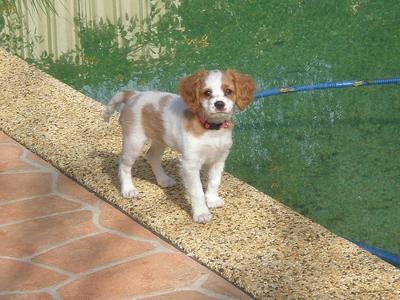
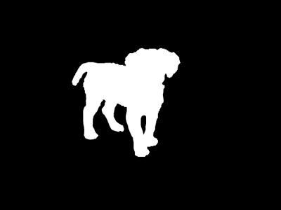
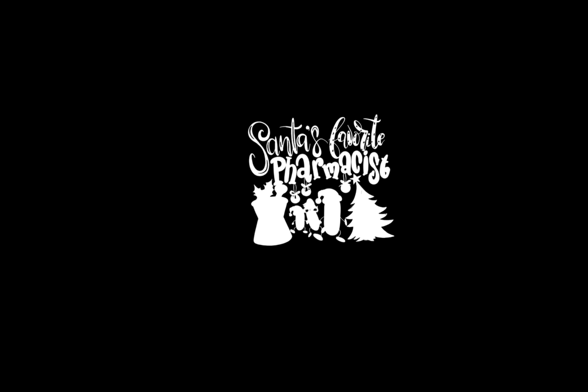

# AUTOMATIC BACKGROUND REMOVAL

## 1. INTRODUCTION 
The project aims to design an application for automating background removal image process. Users can simply upload their images and then choose their desired result to download.

### Project Components:
U-2-Net Model Training:
### We integrate the U-2-Net model training with personal datasets and utilize the rembg tool.
### U-2-Net is initially trained on the DUST_TR dataset, consisting of images and masks. View examples:
 
    
### We continue training with personal datasets structured as follows:            

    # The trained model, combined with the rembg tool, is used for automatic image background removal.
    
    References:
    [U-2-Net](https://github.com/xuebinqin/U-2-Net.git)
    [rembg](https://github.com/danielgatis/rembg.git)
    [Train your custom model](https://github.com/danielgatis/rembg/issues/193#issuecomment-1055534289) 

## 2. FEATURES

 **Remove Background:** Automatically removes the background from uploaded images.

## 3. INSTALLATION

* Clone the repository: https://github.com/tdp1996/Automatic-Batch-Editing.git
* Install dependencies: `pip install -r requirements.txt`

## 4. USAGE

* In 'rmbg.py' file, replace 'model_path' with the direct path to your custom model. If you store your model on github, replace this " _prepare_model('https://github.com/tdp1996/model.git')" with your github path.
* Run the application: streamlit run streamlit  
* Open your browser and go to http://localhost:5000
