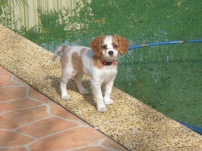
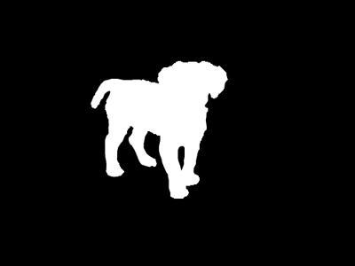
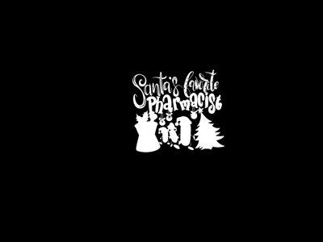

# ABR - AUTOMATIC BACKGROUND REMOVAL

## 1. Introduction 
The project aims to design an application for automating background removal image process. Users can simply upload their images and then choose their desired result to download.

#### Project Components: [U-2-Net](https://github.com/xuebinqin/U-2-Net.git), [rembg](https://github.com/danielgatis/rembg.git)
#### We integrate the U-2-Net model training with personal datasets and utilize the rembg tool.

U-2-Net is initially trained on the [DUST_TR dataset](http://saliencydetection.net/duts/), consisting of images and masks. View examples:

 
    
    
We continue training with personal datasets structured as follows: 

 

The trained model, combined with the rembg tool, is used for automatic image background removal.

#### Note: ABR is still a work in progress and in alpha. While it is slowly getting more to where we want it, it is going to take quite some time to have every possible feature we want to add.
    

## 2. Features

 **Remove Background:** Automatically removes the background from uploaded images.

## 3. Demo
For a quick demo, please visit this website: https://bradpt.streamlit.app/.
You can upload your images and see the result.

## 4. Installation

* Clone the repository: https://github.com/tdp1996/Automatic-Batch-Editing.git
  
* Install dependencies: `pip install -r requirements.txt`

## 5. Usage
 
* Run the application: `streamlit run streamlit.py`
  
* Open your browser and go to http://localhost:5000

### References: 
* U-2-Net: https://github.com/xuebinqin/U-2-Net.git
* rembg: https://github.com/danielgatis/rembg.git
* Train your custom model: https://github.com/danielgatis/rembg/issues/193#issuecomment-1055534289
  

